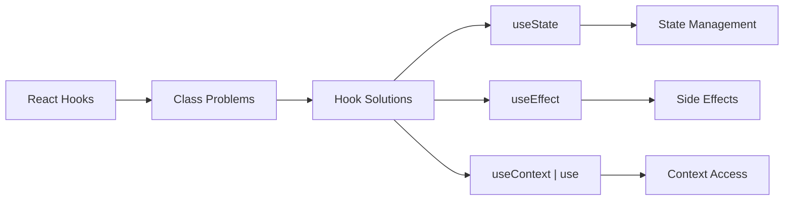
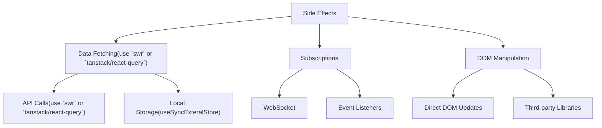

```mermaid
sequenceDiagram
  participant Component
  participant useState
  participant ReactCore

  Component->>useState: Initialize state
  useState->>ReactCore: Register state value
  ReactCore-->>useState: Return [value, setter]
  useState-->>Component: Provide state access

  Note over Component,ReactCore: State Update Cycle
  Component->>useState: Call setter
  useState->>ReactCore: Schedule update
  ReactCore-->>Component: Re-render with new state
```

# React Hooks

<TocIcon />

<div mt-2 />

- <a @click="$slidev.nav.next()">A New Chapter For React Hooks</a>
- <a @click="$slidev.nav.go($nav.currentPage+3)">What is state?</a>
- <a @click="$slidev.nav.go($nav.currentPage+8)">Introduction to React Hooks</a>
- <a @click="$slidev.nav.go($nav.currentPage+9)">Basic Hooks: "useState", "useEffect"</a>
- <a @click="$slidev.nav.go($nav.currentPage+12)">Managing Side Effects with "useEffect"</a>
- <a @click="$slidev.nav.go($nav.currentPage+20)">Complex state (Right way to update objects and arrays in state) - Mutation</a>
- <a @click="$slidev.nav.go($nav.currentPage+23)">Immutability</a>
- <a @click="$slidev.nav.go($nav.currentPage+25)">Rules of Hooks</a>

---
hideInToc: true
---

## A New Chapter in Simplicity🚀

<v-clicks>

- #### React Hooks let you add state, side effects, and other React features to your components without writing classes.

- #### They provide a simpler mental model for sharing logic, reusing behavior, and organizing component code by concern instead of lifecycle methods.

- #### Hooks replace many patterns from class components, making modern React code more predictable, testable, and easier to refactor.

- #### In the following slides, you’ll see how hooks model state, effects, and complex behavior in a clean, composable way. ⚡

- #### They heavy build on a concept in JavaScript called closures and here is a [video](https://www.youtube.com/watch?v=KJP1E-Y-xyo) showing how to implement hooks in a very simple way.

</v-clicks>

---
hideInToc: true
---

## Mental Model Overview


---
hideInToc: true
---

## What is state

<v-clicks>

#### State is data that can change over time in your application. Think of it as the "memory" of your component.


### Key Characteristics of State:

- Mutable: Can change over time
- Persistent: Survives re-renders
- Reactive: Changes trigger re-renders
- Isolated: Local to component (unless shared)

</v-clicks>

---
hideInToc: true
---

## Understanding useState

#### `useState` is a React Hook that lets you add a state variable to your component.

````md magic-move
```js
import { useState } from "react";
```

```js
const stateInitializer = useState(initialState)
const state = stateInitializer[0]
const setState = stateInitializer[1]
```

```js
const [state, setState] = useState(initialState)
```
````

<div class="max-w-md">



</div>

---
hideInToc: true
clicksStart: 1
name: React useState Concepts
---

<v-clicks>

  <div class="max-w-4xl mx-auto bg-white rounded-lg  p-6">
    <h2 class="text-2xl font-bold mb-4 text-gray-800">React useState Concepts</h2>
    <div class="relative">
        <div class="absolute left-0 top-0 bottom-0 w-4 bg-gradient-to-r from-white to-transparent pointer-events-none z-10"></div>
        <div class="absolute right-0 top-0 bottom-0 w-4 bg-gradient-to-l from-white to-transparent pointer-events-none z-10"></div>
        <div class="absolute top-0 left-0 right-0 h-4 bg-gradient-to-b from-white to-transparent pointer-events-none z-10"></div>
        <div class="absolute bottom-0 left-0 right-0 h-4 bg-gradient-to-t from-white to-transparent pointer-events-none z-10"></div>
        <div class="overflow-auto max-h-96 rounded-lg">
            <table class="min-w-full divide-y divide-gray-200">
                <thead>
                    <tr class="bg-gray-50">
                        <th class="sticky top-0 left-0 bg-gray-50 px-6 py-3 text-left text-xs font-medium text-gray-500 uppercase tracking-wider border-b z-20">Concept</th>
                        <th class="sticky top-0 bg-gray-50 px-6 py-3 text-left text-xs font-medium text-gray-500 uppercase tracking-wider border-b z-10 min-w-[200px]">Explanation</th>
                        <th class="sticky top-0 bg-gray-50 px-6 py-3 text-left text-xs font-medium text-gray-500 uppercase tracking-wider border-b z-10 min-w-[300px]">Example</th>
                        <th class="sticky top-0 bg-gray-50 px-6 py-3 text-left text-xs font-medium text-gray-500 uppercase tracking-wider border-b z-10 min-w-[200px]">Common Pitfalls</th>
                        <th class="sticky top-0 bg-gray-50 px-6 py-3 text-left text-xs font-medium text-gray-500 uppercase tracking-wider border-b z-10 min-w-[200px]">Best Practices</th>
                    </tr>
                </thead>
                <tbody class="bg-white divide-y divide-gray-200">
                    <tr class="hover:bg-gray-50">
                        <td class="sticky left-0 bg-white px-6 py-4 whitespace-nowrap font-medium text-gray-900">Basic Usage</td>
                        <td class="px-6 py-4 text-sm text-gray-500">Creates a state variable and its setter function</td>
                        <td class="px-6 py-4 text-sm font-mono bg-gray-50 dark:text-black">const [count, setCount] = useState(0);</td>
                        <td class="px-6 py-4 text-sm text-gray-500">Forgetting to use the setter function</td>
                        <td class="px-6 py-4 text-sm text-gray-500">Use descriptive names for state and setter</td>
                    </tr>
                    <tr class="hover:bg-gray-50">
                        <td class="sticky left-0 bg-white px-6 py-4 whitespace-nowrap font-medium text-gray-900">Direct Updates</td>
                        <td class="px-6 py-4 text-sm text-gray-500">Set the state to a specific new value</td>
                        <td class="px-6 py-4 text-sm font-mono bg-gray-50 dark:text-black">setCount(5);</td>
                        <td class="px-6 py-4 text-sm text-gray-500">Modifying state directly without setter</td>
                        <td class="px-6 py-4 text-sm text-gray-500">Always use setter function for updates</td>
                    </tr>
                    <tr class="hover:bg-gray-50">
                        <td class="sticky left-0 bg-white px-6 py-4 whitespace-nowrap font-medium text-gray-900">Functional Updates</td>
                        <td class="px-6 py-4 text-sm text-gray-500">Update state based on previous value</td>
                        <td class="px-6 py-4 text-sm font-mono bg-gray-50 dark:text-black">setCount(prev => prev + 1);</td>
                        <td class="px-6 py-4 text-sm text-gray-500">Not using functional updates when depending on previous state</td>
                        <td class="px-6 py-4 text-sm text-gray-500">Use when new state depends on previous state</td>
                    </tr>
                    <tr class="hover:bg-gray-50">
                        <td class="sticky left-0 bg-white px-6 py-4 whitespace-nowrap font-medium text-gray-900">Placement Rules</td>
                        <td class="px-6 py-4 text-sm text-gray-500">Must be at top level of component</td>
                        <td class="px-6 py-4 text-sm font-mono bg-gray-50 dark:text-black">
                            function Component() {<br>
                            &nbsp;&nbsp;const [state, setState] = useState(0);<br>
                            }
                        </td>
                        <td class="px-6 py-4 text-sm text-gray-500">Putting useState in conditions or loops</td>
                        <td class="px-6 py-4 text-sm text-gray-500">Always declare at component top level</td>
                    </tr>
                    <tr class="hover:bg-gray-50">
                        <td class="sticky left-0 bg-white px-6 py-4 whitespace-nowrap font-medium text-gray-900">Initial State</td>
                        <td class="px-6 py-4 text-sm text-gray-500">Only used on first render</td>
                        <td class="px-6 py-4 text-sm font-mono bg-gray-50 dark:text-black">const [count, setCount] = useState(0);</td>
                        <td class="px-6 py-4 text-sm text-gray-500">Expensive initial state calculations</td>
                        <td class="px-6 py-4 text-sm text-gray-500">Use useState(() => expensiveCalc()) for heavy computations</td>
                    </tr>
                    <tr class="hover:bg-gray-50">
                        <td class="sticky left-0 bg-white px-6 py-4 whitespace-nowrap font-medium text-gray-900">Update Behavior</td>
                        <td class="px-6 py-4 text-sm text-gray-500">Updates are asynchronous and batched</td>
                        <td class="px-6 py-4 text-sm font-mono bg-gray-50 dark:text-black">
                            setCount(1);<br>
                            setCount(2);
                        </td>
                        <td class="px-6 py-4 text-sm text-gray-500">Expecting immediate updates</td>
                        <td class="px-6 py-4 text-sm text-gray-500">Use useEffect for side effects after state changes</td>
                    </tr>
                    <tr class="hover:bg-gray-50">
                        <td class="sticky left-0 bg-white px-6 py-4 whitespace-nowrap font-medium text-gray-900">Re-render Trigger</td>
                        <td class="px-6 py-4 text-sm text-gray-500">Component re-renders when state changes</td>
                        <td class="px-6 py-4 text-sm font-mono bg-gray-50 dark:text-black">setCount(newValue); // Triggers re-render</td>
                        <td class="px-6 py-4 text-sm text-gray-500">Too many state updates causing performance issues</td>
                        <td class="px-6 py-4 text-sm text-gray-500">Combine related state updates, use useMemo when needed</td>
                    </tr>
                    <tr class="hover:bg-gray-50">
                        <td class="sticky left-0 bg-white px-6 py-4 whitespace-nowrap font-medium text-gray-900">Object State</td>
                        <td class="px-6 py-4 text-sm text-gray-500">Managing object state properly</td>
                        <td class="px-6 py-4 text-sm font-mono bg-gray-50 dark:text-black">setState(prev => ({...prev, key: value}));</td>
                        <td class="px-6 py-4 text-sm text-gray-500">Mutating object state directly</td>
                        <td class="px-6 py-4 text-sm text-gray-500">Always create new object references when updating</td>
                    </tr>
                    <tr class="hover:bg-gray-50">
                        <td class="sticky left-0 bg-white px-6 py-4 whitespace-nowrap font-medium text-gray-900">Array State</td>
                        <td class="px-6 py-4 text-sm text-gray-500">Managing array state properly</td>
                        <td class="px-6 py-4 text-sm font-mono bg-gray-50 dark:text-black">setArray(prev => [...prev, newItem]);</td>
                        <td class="px-6 py-4 text-sm text-gray-500">Using array mutation methods like push()</td>
                        <td class="px-6 py-4 text-sm text-gray-500">Use spread operator or array methods that return new arrays</td>
                    </tr>
                </tbody>
            </table>
        </div>
    </div>
  </div>
</v-clicks>

---
hideInToc: true
---

<ReactStateManagementExplained />

---
hideInToc: true
---

## Practice Question

<div class="text-sm">Create a Toggle component that toggles a text. Check this <a @click="$nav.go(61, 8)">page</a> for an example.</div>

```jsx {monaco-run} {lineNumbers: 'true', height: '20rem'}
function ToggleButton() {
  // Step 1: Create a state variable to track the button's active state. (isActive, setIsActive). React.useState
  // Step 2: Function to toggle the button's active state
  return (
    <>
      <button
        className="btn"
        // Step 3: Add a click event handler to toggle the button's active state
        // Step 4: Use the state variable to conditionally render the button's text and the div below it
      >
        {/* {isActive ? 'ON' : 'OFF'} */ 'Practice'}
      </button>
      {/*<div>It may get difficult but with time you will always get better. This note is filled with gems - dig dont scratch the surface - find and own them, read it and contribute to it.</div>*/}
    </>
  )
}
```

---
hideInToc: true
transition: slide-left
clicksStart: 2
---

<h2 class="underline text-gradient">Introduction to React Hooks</h2>

<v-clicks>

#### Hooks are functions that let you "hook into" React state and lifecycle features from function components.



### Why Hooks?

- Simpler Code: No more class components
- Reusable Logic: Share stateful logic between components
- Composition: Build complex features from simple ones
- Better TypeScript Support: More predictable types

</v-clicks>

---
hideInToc: true
name: Basic Hooks:"useState","useEffect"
---

# Basic Hooks: useState & useEffect

<div class="grid grid-cols-2 gap-8 h-full">

<!-- useState Section -->
<div class="space-y-4">
  <h2 class="text-2xl font-bold text-blue-500">useState</h2>

  <div class="bg-gray-500 p-4 rounded-lg">
    <kbd class="text-sm! mb-2">Syntax:</kbd>
    <pre class="text-xs"><code>const [state, setState] = useState(initialValue)</code></pre>
  </div>

  <div class="space-y-3">

  <div class="p-3 rounded border">

```jsx
function Counter() {
  const [count, setCount] = useState(0);
  const increment = () => setCount(count + 1)

  return (...);
}
```

  </div>
  <div class="bg-green-50 p-3 rounded">
    <h4 class="font-mono text-sm! text-green-800">Key Points:</h4>
    <ul class="text-xs text-green-700 mt-1">
      <li>Returns [value, setter] array</li>
      <li>Initial value only used on first render</li>
      <li>State updates trigger re-renders</li>
      <li>Always call at top level of component</li>
    </ul>
  </div>
  </div>
</div>

<!-- useEffect Section -->
<div class="space-y-4">
  <h2 class="text-2xl font-bold text-green-500">useEffect</h2>

  <div class="bg-gray-500 p-4 rounded-lg">
    <kbd class="text-sm! mb-2">Syntax:</kbd>
    <pre class="text-sm"><code>useEffect(setup, dependencies?)</code></pre>
  </div>

  <div class="space-y-3">

  <div class="p-3 rounded border overflow-auto">

````md magic-move {class: 'overflow-auto'}
```jsx
function LiveData() {
  const [data, setData] = useState(null);

  useEffect(function effect() {
    // Side effect code here
    subscribe().then(setData);
    // Cleanup function (optional)
    return () => {
      // Cleanup code
    };
  }, []); // Dependencies array

  return <div>{...}</div>;
}
```

```jsx
function WindowSize() {
  useEffect(() => {
    const handleResize = () => {
      // Update size state
    }

    window.addEventListener('resize', handleResize)
    return () => window.removeEventListener('resize', handleResize)
  }, []) // Empty deps = only on mount/unmount
}
```

```jsx
function DataFetcher({ id }) {
  const [data, setData] = useState(null)
  useEffect(() => {
    let mounted = true // 1. Effect Setup
    async function fetchData() {
      const result = await fetch(`https://api.github.com/users/${id}`)
      const json = await result.json()
      setData(json)
    }
    if (mounted) fetchData()
    return () => mounted = false // 2. Effect Cleanup
  }, [id]) // 3. Dependencies
  return <div>{data ? <DisplayData data={data} /> : 'Loading...'}</div>
}
```
````

  </div>

  <div class="absolute top-5 right-1 z-10 bg-blue-50 p-2 mb-2 rounded">
    <h4 class="font-mono text-sm! text-blue-800">Dependency Patterns:</h4>
    <ul class="text-sm! text-blue-700 mt-1">
      <li><code>[]</code> - Run once on mount</li>
      <li><code>[dep1, dep2]</code> - Run when deps change</li>
      <li>No array - Run after every render</li>
      <li>Return function for cleanup</li>
    </ul>
  </div>
  </div>
</div>

</div>

---
hideInToc: true
name: useEffect Hook
---

### useEffect Hook


---
hideInToc: true
name: Fetching Data with useEffect
---

```js
function DataFetcher({ id }) {
  const [data, setData] = useState(null)

  useEffect(() => {
    // 1. Effect Setup
    let mounted = false

    async function fetchData() {
      const result = await fetch(`https://api.github.com/users/${id}`)
      const json = await result.json()

      if (!mounted) {
        setData(json)
      }
    }

    fetchData()

    // 2. Effect Cleanup
    return () => {
      mounted = true
    }
  }, [id]) // 3. Dependencies

  return <div>{data ? <DisplayData data={data} /> : 'Loading...'}</div>
}
```

---
hideInToc: true
name: useEffect
---

# Managing Side Effects



---
hideInToc: true
name: Managing Side Effects
---

```js
// 1. Data Fetching
function UserProfile({ userId }) {
  useEffect(() => {
    // Only fetch when userId changes, add a variable like ignore or mount to avoid race condition
    fetchUser(userId).then(setUser)
  }, [userId])
}

// 2. Event Listeners
function WindowSize() {
  useEffect(() => {
    const handleResize = () => {
      // Update size state
    }

    window.addEventListener('resize', handleResize)
    return () => window.removeEventListener('resize', handleResize)
  }, []) // Empty deps = only on mount/unmount
}

// 3. Subscriptions
function LiveData() {
  useEffect(() => {
    const subscription = dataSource.subscribe(handleData)
    return () => subscription.unsubscribe()
  }, [dataSource])
}
```

---
hideInToc: true
---

### The New <kbd> use() </kbd> Hook: A Game Changer

#### The versatile new <kbd> use() </kbd> hook replaces multiple hooks, such as useEffect for data fetching as well as useContext and useState for consuming context data. It simplifies your code by handling promises and context with a single, elegant solution.


---
hideInToc: true
---

### Fetching Data and Context Usage

````md magic-move
```js
import { use } from 'react'

// 1. Resource Definition
const fetchUsers = async () => {
  const res = await fetch('https://api.example.com/users')
  return res.json()
}

// 2. Data Access
const UsersList = () => {
  const users = use(fetchUsers())

  // 3. Render Pattern
  return (
    <Suspense>
      <ul>
        {users.map((user) => (
          <div key={user.id}>
            <h2>{user.name}</h2>
            <p>{user.email}</p>
          </div>
        ))}
      </ul>
    </Suspense>
  )
}
```

```js
import { createContext, use } from 'react'

const ThemeContext = createContext()

const ThemeConsumer = () => {
  const { theme, toggleTheme } = use(ThemeContext)

  return <button onClick={toggleTheme}>Current theme: {theme}</button>
}
```
````

---
hideInToc: true
---

<div class="p-2 rounded text-base bg-red-500">Form Handling Hooks</div>

The <kbd>useFormStatus()</kbd> hook (React 19)

<v-clicks>

This hook provides real-time information about form submission status.

<kbd>Syntax</kbd>

````md magic-move
```js
const { pending, data, method, action } = useFormStatus()
```

```js
const status = useFormStatus()
```
````

<div class="max-w-md">


</div>

</v-clicks>

---
hideInToc: true
name: Form Hook Demo
---

<FormHookDemo />

---
hideInToc: true
---

`useActionState()`

This hook manages form state and updates based on submission results.

````md magic-move
```js
const [state, formAction] = useActionState(fn, initialState, permalink?)
```

```js
import { useActionState } from 'react'

function Form() {
  const handleSubmit = async (prevState, formData) => {
    const username = formData.get('username')
    return username === 'admin'
      ? { success: true, message: 'Welcome!' }
      : { success: false, message: 'Invalid username' }
  }

  const [state, formAction] = useActionState(handleSubmit, null)

  return (
    <form action={formAction}>
      <input type="text" name="username" />
      <button type="submit">Login</button>
      {state && <p>{state.message}</p>}
    </form>
  )
}
```
````

---
hideInToc: true
name: SearchFormExercise
---

<SearchFormExercise />

---
hideInToc: true
---

<div class="flex p-2 border rounded bg-red-500 font-bold-600">
  <span>Complex State Management</span>
  <span ml-3 pl-3 border-l text-gradient>Updating Objects and Arrays (Updating Objects and Arrays)</span>
</div>

<div class="text-sm">
When working with complex state, such as objects and arrays, it's important to avoid mutating the state directly. Instead, you should create new objects and arrays using the spread operator (...) or <kbd> Array.prototype.map() </kbd> and <kbd> Array.prototype.filter()</kbd>.
</div>

##### Updating Objects:

```js
const [person, setPerson] = useState({ name: 'John', age: 30 })

// Correct way to update an object
setPerson({ ...person, age: 31 })
```

##### Updating Arrays:

```js
const [items, setItems] = useState([1, 2, 3])

// Correct way to update an array
setItems([...items, 4])
setItems(items.filter((item) => item !== 2))
```

Maintaining immutability in your state updates is crucial for React's efficient re-rendering and comparison of previous and current state.

---
hideInToc: true
---

<div class="p-2 border rounded bg-red-500 font-bold-600">Complex State Updates</div>

<!--prettier-ignore-->
```js{8-11,15-21|*}
function FormWithComplexState() {
  const [form, setForm] = useState({
    user: { name: '', email: '', },
    preferences: { newsletter: false, theme: 'light', },
  })
  // Updating nested state
  const updateName = (name) => {
    setForm((prev) => ({
      ...prev,
      user: { ...prev.user, name, },
    }))
  }
  // Using state updater function
  const toggleNewsletter = () => {
    setForm((prev) => ({
      ...prev,
      preferences: {
        ...prev.preferences,
        newsletter: !prev.preferences.newsletter,
      },
    }))
  }
}
```

---
hideInToc: true
---

<div class="p-2 border rounded bg-red-500 font-bold-600">Immutability</div>

Immutability refers to the concept of not modifying an object or array directly, but rather creating a new one with the desired changes. This is an important principle in React, as it allows React to efficiently determine what has changed between renders and optimize the rendering process.
When you update state in React, you should always create a new object or array instead of modifying the existing one. This ensures that React can effectively compare the previous and current state and update the DOM efficiently.

---
hideInToc: true
name: Understanding Immutability in React
---

<div class="max-h-screen overflow-y-auto">
    <!-- Content wrapper with padding -->
    <div class="p-6">
      <div class="max-w-6xl mx-auto">
        <h1 class="text-3xl font-bold mb-6 text-gray-300">Understanding Immutability in React</h1>
        <div class="bg-white rounded-lg shadow-lg overflow-hidden mb-8">
          <div class="overflow-x-auto">
            <table class="w-full">
              <thead class="bg-gray-800 text-white">
                <tr>
                  <th class="px-6 py-4 text-left">Operation</th>
                  <th class="px-6 py-4 text-left">❌ Mutable (Wrong)</th>
                  <th class="px-6 py-4 text-left">✅ Immutable (Correct)</th>
                  <th class="px-6 py-4 text-left">Explanation</th>
                </tr>
              </thead>
              <tbody class="divide-y divide-gray-200">
                <tr class="hover:bg-gray-50">
                  <td class="px-6 py-4 font-medium dark:text-black">Update Object Property</td>
                  <td class="px-6 py-4">
                    <pre class="bg-red-50 p-2 rounded"><code class="text-sm text-red-600">person.age = 31;</code></pre>
                  </td>
                  <td class="px-6 py-4">
                    <pre class="bg-green-50 p-2 rounded"><code class="text-sm text-green-600">setPerson({ ...person, age: 31 });</code></pre>
                  </td>
                  <td class="px-6 py-4 text-sm text-gray-600">Creates a new object with updated age property while keeping other properties unchanged</td>
                </tr>
                <tr class="hover:bg-gray-50">
                  <td class="px-6 py-4 font-medium dark:text-black">Add Array Item</td>
                  <td class="px-6 py-4">
                    <pre class="bg-red-50 p-2 rounded"><code class="text-sm text-red-600">items.push(4);</code></pre>
                  </td>
                  <td class="px-6 py-4">
                    <pre class="bg-green-50 p-2 rounded"><code class="text-sm text-green-600">setItems([...items, 4]);</code></pre>
                  </td>
                  <td class="px-6 py-4 text-sm text-gray-600">Creates a new array with all existing items plus the new item</td>
                </tr>
                <tr class="hover:bg-gray-50">
                  <td class="px-6 py-4 font-medium dark:text-black">Remove Array Item</td>
                  <td class="px-6 py-4">
                    <pre class="bg-red-50 p-2 rounded"><code class="text-sm text-red-600">items.splice(index, 1);</code></pre>
                  </td>
                  <td class="px-6 py-4">
                    <pre class="bg-green-50 p-2 rounded"><code class="text-sm text-green-600">setItems(items.filter(item => item !== 2));</code></pre>
                  </td>
                  <td class="px-6 py-4 text-sm text-gray-600">Creates a new array excluding the specified item</td>
                </tr>
                <tr class="hover:bg-gray-50">
                  <td class="px-6 py-4 font-medium dark:text-black">Update Nested Object</td>
                  <td class="px-6 py-4">
                    <pre class="bg-red-50 p-2 rounded"><code class="text-sm text-red-600">user.address.city = 'New York';</code></pre>
                  </td>
                  <td class="px-6 py-4">
                    <pre class="bg-green-50 p-2 rounded"><code class="text-sm text-green-600">setUser({
  ...user,
  address: {
    ...user.address,
    city: 'New York'
  }
});</code></pre>
                  </td>
                  <td class="px-6 py-4 text-sm text-gray-600">Creates a new object with updated nested property while maintaining immutability at all levels</td>
                </tr>
              </tbody>
            </table>
          </div>
        </div>
        <div class="grid grid-cols-2 gap-8 mb-8">
          <!-- Before Update -->
          <div class="bg-white p-6 rounded-lg shadow-lg">
            <h3 class="text-lg font-semibold mb-4 text-gray-800">Before Update</h3>
            <div class="space-y-4">
              <div class="p-4 bg-blue-50 rounded-lg">
                <pre class="text-sm text-blue-600">const person = {
  name: 'John',
  age: 30,
  address: {
    city: 'Boston',
    country: 'USA'
  }
};</pre>
              </div>
            </div>
          </div>
          <div class="bg-white p-6 rounded-lg shadow-lg">
            <h3 class="text-lg font-semibold mb-4 text-gray-800">After Immutable Update</h3>
            <div class="space-y-4">
              <div class="p-4 bg-green-50 rounded-lg">
                <pre class="text-sm text-green-600">setPerson({
  ...person,
  age: 31,
  address: {
    ...person.address,
    city: 'New York'
  }
});</pre>
              </div>
              <div class="text-sm text-gray-600">
                ✓ New object created<br>
                ✓ Original object unchanged<br>
                ✓ React can detect changes<br>
                ✓ Efficient re-rendering
              </div>
            </div>
          </div>
        </div>
        <div class="bg-white p-6 rounded-lg shadow-lg mb-800px">
          <h3 class="text-lg font-semibold mb-4 text-gray-800">Benefits of Immutability</h3>
          <div class="grid grid-cols-3 gap-6">
            <div class="p-4 bg-gray-50 rounded-lg">
              <h4 class="font-medium mb-2 dark:text-black">Predictable State Updates</h4>
              <p class="text-sm text-gray-600">State changes are more predictable because objects cannot be modified after creation</p>
            </div>
            <div class="p-4 bg-gray-50 rounded-lg">
              <h4 class="font-medium mb-2 dark:text-black">Efficient Change Detection</h4>
              <p class="text-sm text-gray-600">React can quickly determine if state has changed by comparing object references</p>
            </div>
            <div class="p-4 bg-gray-50 rounded-lg">
              <h4 class="font-medium mb-2 dark:text-black">Pure Components</h4>
              <p class="text-sm text-gray-600">Enables the use of pure components for better performance optimization</p>
            </div>
          </div>
        </div>
      </div>
    </div>
  </div>

---
hideInToc: true
---

## Example

```jsx {monaco-diff}
function TodoList() {
  const [todos, setTodos] = useState([]);

  // ❌ Wrong way (mutation)
  const addTodoWrong = (text) => {
    todos.push({ text, completed: false });
    setTodos(todos);
  };

  return (/* JSX */);
}

~~~
function TodoList() {
  const [todos, setTodos] = useState([]);

  // ✅ Right way (immutable)
  const addTodoRight = (text) => {
    setTodos([...todos, { text, completed: false }]);
  };

  // ✅ Updating nested objects
  const updateTodo = (id, updates) => {
    setTodos(todos.map(todo =>
      todo.id === id ? { ...todo, ...updates } : todo
    ));
  };

  return (/* JSX */);
}
```

---
hideInToc: true
---

# Rules Of Hook


---
hideInToc: true
name: Rules of Hooks
---

<RuleHooks />

---
hideInToc: true
name: HookForm
---

<HookForm />

---

## [Assignment]{.text-gradient.text-4xl}

1. Using the websocket provision in the [API](https://api.oluwasetemi.dev), use effect hook to create a real time display of `tasks` created, updated and delete. You job is to create a simple react application to show the realtime display of the socket communication. See this as an example [Tasks Socket Client](https://api.oluwasetemi.dev/ws/client/tasks).

2. Implement a custom hook for this socket communication.

---
hideInToc: true
---

```jsx {monaco-run} {lines: 'true', height: '25rem'}

function LiveData() {
  class SimpleEventEmitter {
    constructor() {
      this.events = {};
    }
  
    on(event, listener) {
      if (!this.events[event]) {
        this.events[event] = [];
      }
      this.events[event].push(listener);
    }
  
    off(event, listener) {
      if (!this.events[event]) return;
      this.events[event] = this.events[event].filter(l => l !== listener);
    }
  
    emit(event, ...args) {
      if (!this.events[event]) return;
      this.events[event].forEach(listener => listener(...args));
    }
  }
  const [num, setNum] = React.useState(0);
  const [data, setData] = React.useState(undefined);
  const [error, setError] = React.useState(undefined);
  
  // Use useRef to persist the event emitter across renders
  const eventRef = React.useRef(null);
  if (!eventRef.current) {
    eventRef.current = new SimpleEventEmitter();
  }
  const event = eventRef.current;

  React.useEffect(() => {
    if (num % 3 === 0 && num > 1) {
      const err = new Error("error:" + num);
      event.emit("error", err);
    } else {
      event.emit("data", "state:" + num);
    }
  }, [num, event]);
  
  React.useEffect(() => {
    const onData = (value) => {
      setData(value);
      setError(undefined);
    };

    const onError = (err) => {
      setError(err);
      setData(undefined);
    };

    event.on("data", onData);
    event.on("error", onError);

    return () => {
      event.off("data", onData);
      event.off("error", onError);
    };
  }, [event]);

  React.useEffect(() => {
    const timer = setInterval(() => {
      setNum((prevNum) => prevNum + 1); // Use functional update
    }, 1000);

    return () => clearInterval(timer);
  }, []);

  return (
    <div>
      <div>{data}</div>
      <div>error: {error ? error.message : ""}</div>
    </div>
  )
}
```

---
hideInToc: true
---

```jsx {monaco-run} {lines: 'true', height: '25rem'}

/**
 * An Async Generator that acts as our data source.
 * It manages its own internal state (num) and timing loop.
 */

function LiveData() {
  const [data, setData] = React.useState(undefined);
  const [error, setError] = React.useState(undefined);
  
  async function* liveDataGenerator() {
    let num = 0;
    
    while (true) {
      // 1. Pause execution for 1 second (simulating network/compute latency)
      await new Promise((resolve) => setTimeout(resolve, 1000));
      
      // 2. Update internal state
      num++;
  
      // 3. Determine what to yield based on the logic
      // We return an object distinguishing data from errors to keep the stream alive.
      // (Throwing an actual Error would terminate the generator).
      if (num % 3 === 0 && num > 1) {
        yield { type: 'error', payload: new Error("error:" + num) };
      } else {
        yield { type: 'data', payload: "state:" + num };
      }
    }
  }

  React.useEffect(() => {
    // Initialize the generator
    const stream = liveDataGenerator();
    let isMounted = true;

    const consumeStream = async () => {
      // "for await" handles the async stream automatically
      for await (const event of stream) {
        if (!isMounted) break; // Cleanup check

        if (event.type === 'error') {
          setError(event.payload);
          setData(undefined);
        } else {
          setData(event.payload);
          setError(undefined);
        }
      }
    };

    consumeStream();

    // Cleanup function to prevent setting state on unmounted component
    return () => {
      isMounted = false;
      // Note: Generators are not cancellable by default from the outside
      // without AbortSignal, but stopping consumption is enough for React state safety.
    };
  }, []);

  return (
    <div>
      <div>{data}</div>
      <div>error: {error ? error.message : ""}</div>
    </div>
  );
}
```
